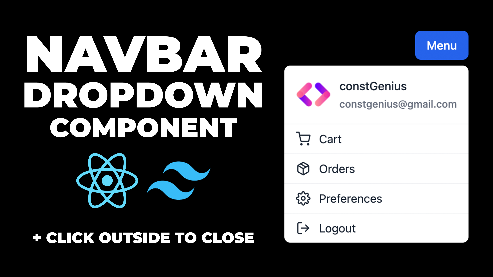

# Navbar Dropdown Menu in React from scratch | Custom Dropdown Menu in React and Tailwind CSS

The Navbar Dropdown Menu in React from scratch, paired with Tailwind CSS, guides developers through the creation of a custom and responsive dropdown menu component. This tutorial empowers React developers to build a dynamic and stylish navigation solution, incorporating a dropdown feature for a seamless user experience. By combining the power of React for component-based architecture and Tailwind CSS for efficient styling, this guide ensures that developers can easily integrate and customize a feature-rich dropdown menu that enhances the navigation capabilities of their React applications.

Youtube Tutorial Link: https://youtu.be/PQ6bdaxtIK8

